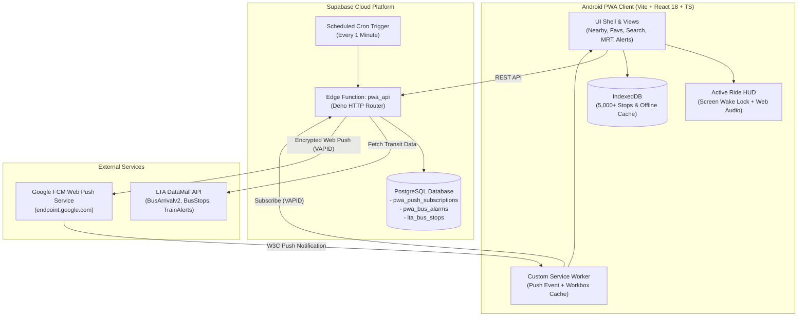
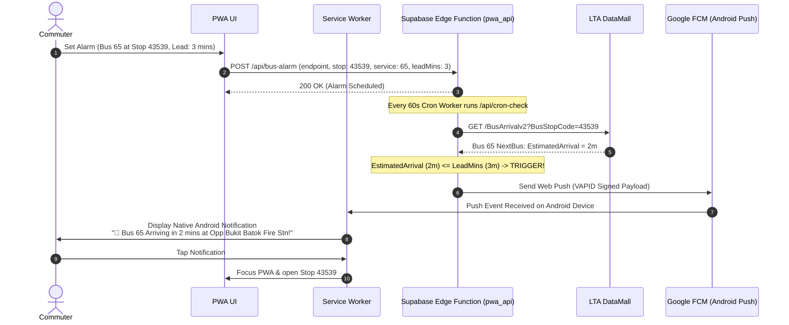
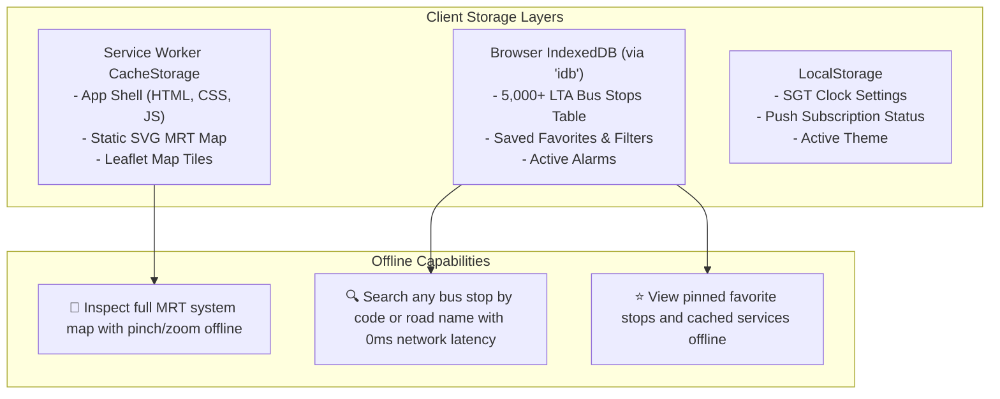

# 🏛️ System Architecture - SG Bus Kaki PWA

This document outlines the end-to-end technical architecture for the **SG Bus Kaki Progressive Web App (PWA)**, detailing the frontend client, service worker lifecycle, Web Push notification infrastructure, and Supabase Edge Function backend.

---

## 1. High-Level Architecture



---

## 2. Web Push Notification Architecture

Web Push allows the PWA to alert commuters on Android even when the browser tab is closed and the phone screen is locked.

### 2.1 VAPID Authentication Lifecycle

1. **VAPID Key Generation**:
   - The backend holds a cryptographic VAPID keypair (`VAPID_PUBLIC_KEY`, `VAPID_PRIVATE_KEY`).
2. **Client Subscription**:
   - When the commuter enables notifications in the Alerts Hub:
   ```typescript
   // 1. Fetch public key from Edge Function
   const { publicKey } = await fetch('/api/vapid-public-key').then(r => r.json());
   
   // 2. Subscribe via PushManager
   const registration = await navigator.serviceWorker.ready;
   const subscription = await registration.pushManager.subscribe({
     userVisibleOnly: true,
     applicationServerKey: urlBase64ToUint8Array(publicKey)
   });
   
   // 3. Save subscription payload to Supabase
   await fetch('/api/subscribe', {
     method: 'POST',
     headers: { 'Content-Type': 'application/json' },
     body: JSON.stringify({
       endpoint: subscription.endpoint,
       keys: {
         p256dh: btoa(String.fromCharCode(...new Uint8Array(subscription.getKey('p256dh')))),
         auth: btoa(String.fromCharCode(...new Uint8Array(subscription.getKey('auth'))))
       },
       mrt_lines: ['EWL', 'NSL'],
       alert_filter: 'major'
     })
   });
   ```

### 2.2 Dynamic Bus Arrival Countdown Push Flow



---

## 3. Alighting Wake-Up Alarm Architecture

Unlike bus arrivals (which are handled server-side because the user is waiting), the **Alighting Alarm** occurs while the user is actively riding the bus.

### 3.1 Overcoming Android Background Throttling
Android OS places background browser tabs and GPS to sleep after a short duration to conserve battery. To guarantee 100% reliability while sleeping or reading on the bus:

1. **W3C Screen Wake Lock API**:
   - Acquires a system wake lock (`navigator.wakeLock.request('screen')`), preventing Android from turning off the display or putting the GPS chip into low-power sleep mode.
2. **OLED Battery-Saver UI (Active Ride HUD)**:
   - When the alarm is armed, the app switches to an ultra-dark mode where 90%+ of screen pixels are pure black (`#000000`). On AMOLED/OLED screens (found in almost all modern Android phones), black pixels consume near-zero power.
3. **Web Audio API Multi-Tone Synthesizer**:
   - Does not rely on streaming or playing external audio files (which can fail if offline or muted by media volume). Instead, it synthesizes an oscillating square-wave sequence directly into the audio output:
   ```typescript
   function playBuzzer() {
     const audioCtx = new (window.AudioContext || (window as any).webkitAudioContext)();
     const osc = audioCtx.createOscillator();
     const gain = audioCtx.createGain();
     osc.type = 'square';
     osc.frequency.setValueAtTime(880, audioCtx.currentTime); // A5 note
     osc.frequency.setValueAtTime(1760, audioCtx.currentTime + 0.2); // A6 note
     gain.gain.setValueAtTime(1.0, audioCtx.currentTime);
     osc.connect(gain);
     gain.connect(audioCtx.destination);
     osc.start();
     osc.stop(audioCtx.currentTime + 0.5);
   }
   ```
4. **Tactile Haptic Feedback**:
   - Vibrates the phone in an urgent pulse pattern: `navigator.vibrate([800, 300, 800, 300, 1200])`.

---

## 4. Offline Storage & Caching Architecture

Commuters frequently experience network loss in subterranean MRT stations, tunnels, and underground bus interchanges.



---

## 5. Database Schema Specification (Supabase PostgreSQL)

```sql
-- 1. Web Push Subscriptions Table
CREATE TABLE IF NOT EXISTS pwa_push_subscriptions (
    id BIGSERIAL PRIMARY KEY,
    endpoint TEXT NOT NULL UNIQUE,
    p256dh TEXT NOT NULL,
    auth TEXT NOT NULL,
    mrt_lines TEXT[] DEFAULT ARRAY[]::TEXT[],
    alert_filter TEXT DEFAULT 'major', -- 'major' or 'all'
    user_agent TEXT,
    created_at TIMESTAMPTZ DEFAULT NOW(),
    updated_at TIMESTAMPTZ DEFAULT NOW()
);

CREATE INDEX IF NOT EXISTS idx_pwa_push_endpoint ON pwa_push_subscriptions(endpoint);

-- 2. Bus Arrival Countdown Alarms Table
CREATE TABLE IF NOT EXISTS pwa_bus_alarms (
    id BIGSERIAL PRIMARY KEY,
    endpoint TEXT NOT NULL REFERENCES pwa_push_subscriptions(endpoint) ON DELETE CASCADE,
    bus_stop_code VARCHAR(10) NOT NULL,
    bus_stop_name VARCHAR(120),
    service_no VARCHAR(10) NOT NULL,
    lead_mins INT NOT NULL DEFAULT 3, -- 2, 3, 5, etc.
    fired BOOLEAN NOT NULL DEFAULT FALSE,
    created_at TIMESTAMPTZ DEFAULT NOW(),
    expires_at TIMESTAMPTZ DEFAULT (NOW() + INTERVAL '45 minutes')
);

CREATE INDEX IF NOT EXISTS idx_pwa_alarms_active ON pwa_bus_alarms(fired, expires_at);

-- 3. MRT Alert State Tracking Table (Shared with LTA Monitor)
CREATE TABLE IF NOT EXISTS pwa_mrt_alert_state (
    id INT PRIMARY KEY DEFAULT 1,
    last_status INT DEFAULT 1,
    last_affected JSONB DEFAULT '[]'::JSONB,
    last_message TEXT,
    updated_at TIMESTAMPTZ DEFAULT NOW()
);
```

---

## 6. Backend API Specification (`pwa_api`)

Base URL: `https://<supabase-project-ref>.supabase.co/functions/v1/pwa_api`

| Endpoint | Method | Payload | Response | Description |
| :--- | :--- | :--- | :--- | :--- |
| `/api/vapid-public-key` | `GET` | None | `{ publicKey: string }` | Returns public VAPID key for PushManager |
| `/api/subscribe` | `POST` | `{ endpoint, keys, mrt_lines, alert_filter }` | `{ ok: true }` | Registers or updates Web Push subscription |
| `/api/bus-alarm` | `POST` | `{ endpoint, stopCode, stopName, serviceNo, leadMins }` | `{ ok: true, alarmId }` | Arms dynamic arrival countdown alarm |
| `/api/bus-alarm/:id` | `DELETE` | None | `{ ok: true }` | Cancels active arrival alarm |
| `/api/bus-nearby` | `GET` | Query: `?lat=1.35&lon=103.82&limit=15` | `{ ok: true, stops: [...] }` | Returns nearby bus stops sorted by distance |
| `/api/bus-arrivals` | `GET` | Query: `?stop=43539` | `{ ok: true, stopCode, services: [...] }` | Returns live arrivals, loads, and fleet types |
| `/api/bus-search` | `GET` | Query: `?q=Orchard` | `{ ok: true, stops: [...], services: [...] }` | Search stops and service routes |
| `/api/bus-route` | `GET` | Query: `?service=65&direction=1` | `{ ok: true, stops: [...] }` | Returns sequential stops for bus route |
| `/api/cron-check` | `POST` | Authorization header | `{ processedAlarms: n, mrtAlertsSent: n }` | 1-minute cron check for alarms & MRT health |
